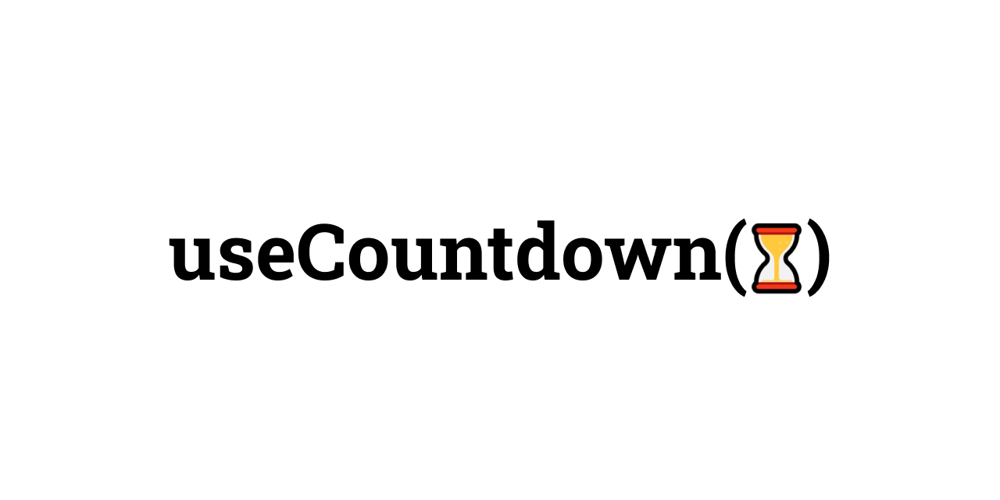

# ✍️⌨️📜 useTypewriter hook

[![version][version-badge]][npm]
[![downloads][downloads-badge]][npm]
[![size][size-badge]][bundlephobia]
[![github actions][github-actions-badge]][github-actions]
[![codecov][codecov-badge]][codecov]
[![typescript][typescript-badge]][typescript]
[![contributing][contributing-badge]][contributing]
[![contributors][contributors-badge]][contributors]

_Simple [React][react] hook for typewriter effect._

<p align="center">
    <a href="https://www.npmjs.com/package/@gfmachado/use-typewriter">
        
    </a>
</p>

## 📦 Installation

This package is hosted on [npm][npm].

```bash
npm install @gfmachado/use-typewriter
```

## 🔧 Usage

In any React component, import `useTypewriter`, then call it like any other [hook][hooks]. The returned `typewriter` instance will update every second with the remaining time.

```typescript
import React, { useRef } from 'react';
import useCountdown from '@gfmachado/use-typewriter';

const App = () => {
  const targetRef = useRef<HTMLDivElement>(null);
  const typewriter = useTypewriter({
    targetRef,
    speed: 150,
    cursor: true,
    loop: true,
  });

  React.useEffect(() => {
    typewriter
      .write("Hello, world!")
      .stop(500)
      .delete(6)
      .write("Typewriter!")
      .start();
  }, [typewriter]);

  return <div ref={targetRef} />;
};

export default App;
```

## 📖 API Reference

### `useTypewriter({ targetRef, loop: true })`

### Options

| Option        | Type                         | Default Value | Description                                                    |
| ------------- | ---------------------------- | ------------- | -------------------------------------------------------------- | -------------------------------------------------- |
| `targetRef`   | `React.RefObject<HTMLElement | null>`        | -                                                              | The target element to apply the typewriter effect. |
| `speed`       | `number`                     | `100`         | Typing and deleting speed in milliseconds per character.       |
| `cursor`      | `boolean`                    | `true`        | Whether to display a blinking cursor.                          |
| `cursorChar`  | `string`                     | `"            | "`                                                             | The character to use for the blinking cursor.      |
| `cursorSpeed` | `number`                     | `450`         | The speed of the blinking cursor in milliseconds.              |
| `loop`        | `boolean`                    | `false`       | Whether to loop the typewriter queue.                          |
| `onWrite`     | `(text: string) => void`     | -             | Callback function called when new text is written.             |
| `onDelete`    | `(text: string) => void`     | -             | Callback function called when text is deleted.                 |
| `onComplete`  | `() => void`                 | -             | Callback function called when the typewriter completes a loop. |

This table summarizes the configuration options and their default values, along with descriptions for each. | | | | | |

### Instance Methods

| Method           | Description                                         |
| ---------------- | --------------------------------------------------- |
| `write(text)`    | Appends new text to the output.                     |
| `delete(count)`  | Deletes a specified number of characters.           |
| `stop(duration)` | Pauses the effect for a specified duration (in ms). |
| `start()`        | Starts processing the typewriter queue.             |
| `reset()`        | Clears all text and pending tasks from the queue.   |

Starts a typewriter effect based on the provided options. The returned `TypewriterInstance` object works like a chainable actions queue, it means you can combine actions like write, stop or delete. Just don't forget to call `start()` as the last chain method.

```

## ❔ Questions

🐛📢 Report bugs and provide feedback by filing [issues][issues]

## ✨ Contributors

<!-- ALL-CONTRIBUTORS-LIST:START - Do not remove or modify this section -->
<!-- prettier-ignore-start -->
<!-- markdownlint-disable -->
<table>
  <tbody>
    <tr>
      <td align="center" valign="top" width="14.28%"><a href="https://gfmachado.dev"><br /><sub><b>Gabriel Machado</b></sub></a><br /></td>
    </tr>
  </tbody>
</table>

<!-- markdownlint-restore -->
<!-- prettier-ignore-end -->

<!-- ALL-CONTRIBUTORS-LIST:END -->

[issues]: https://github.com/thegfmachado/use-typewriter/issues
[react]: https://reactjs.org
[npm]: https://www.npmjs.com/package/@gfmachado/use-countdown
[hooks]: https://reactjs.org/docs/hooks-intro.html
[bundlephobia]: https://bundlephobia.com/result?p=@gfmachado/use-typewriter
[github-actions]: https://github.com/gfmachado/use-typewriter/actions
[codecov]: https://app.codecov.io/gh/gfmachado/use-typewriter
[typescript]: https://www.typescriptlang.org/dt/search?search=%40gfmachado%2Fuse-typewriter
[contributing]: https://github.com/thegfmachado/use-typewriter/blob/master/contributing.md
[contributors]: #-Contributors
[version-badge]: https://img.shields.io/npm/v/@gfmachado/use-typewriter.svg?style=flat-square
[downloads-badge]: https://img.shields.io/npm/dt/@gfmachado/use-typewriter?style=flat-square
[size-badge]: https://img.shields.io/bundlephobia/minzip/@gfmachado/use-typewriter?style=flat-square
[github-actions-badge]: https://img.shields.io/github/workflow/status/gfmachado/use-typewriter/%F0%9F%9A%80%20release?style=flat-square
[codecov-badge]: https://img.shields.io/codecov/c/github/gfmachado/use-typewriter?style=flat-square
[typescript-badge]: https://img.shields.io/npm/types/@gfmachado/use-typewriter?style=flat-square
[contributing-badge]: https://img.shields.io/badge/PRs-welcome-success?style=flat-square
[contributors-badge]: https://img.shields.io/github/all-contributors/gfmachado/use-typewriter?style=flat-square
```
